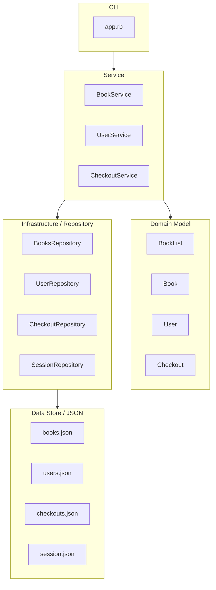
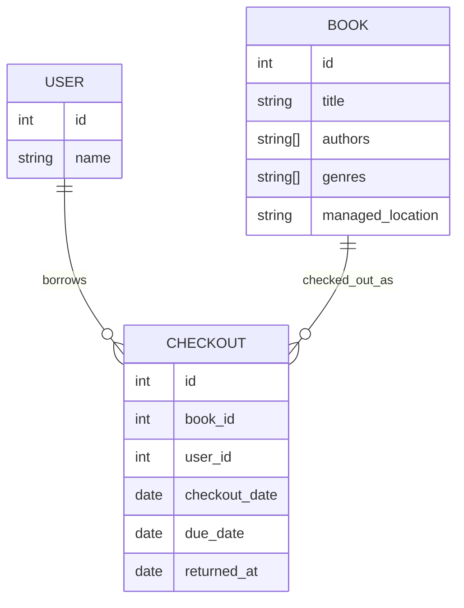

# ドメイン設計

## 目的

実装前にアプリで扱うドメインと責務を整理する。
Book / managed_location / Checkout の関係を明確にし、モデルの責務が混ざらないようにする。

## 現状の課題と方針

Book に location を持たせると、Book が「本そのもの」と「物理的な1冊の所在」の両方を表してしまう。

ここで扱う location は「今どこにあるか」ではなく、「どこが管理しているか（野村 or アネックス）」を表す固定属性とする。
そのため、現在誰が本を所有しているかは Book には持たせず、Checkout が user_id と book_id を持つことで管理する。

location は引き続き Book モデルの管理対象とし、現在地ではなく管理拠点であることが分かるように、名称を managed_location へ変更する。

## フローチャート図

## E-R 図

## 各モデルの責務

### BookList

Book の集合操作をまとめる。

持つもの:

- books

持たないもの:

- 保存形式
- 表示形式
- ログイン状態

### Book

本そのものの情報を表す。

持つもの:

- id
- title
- authors
- genres
- managed_location

持たないもの:

- 現在の所有者
- 貸出状態
- 保存形式

### User

利用者を表す。

持つもの:

- id
- name

持たないもの:

- ログイン状態
- 貸出中の本の一覧
- 保存形式

### Checkout

誰がどの本を借りているかを表す。

持つもの:

- id
- book_id
- user_id
- checkout_date
- due_date
- returned_at
