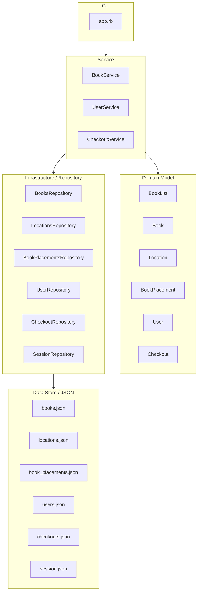
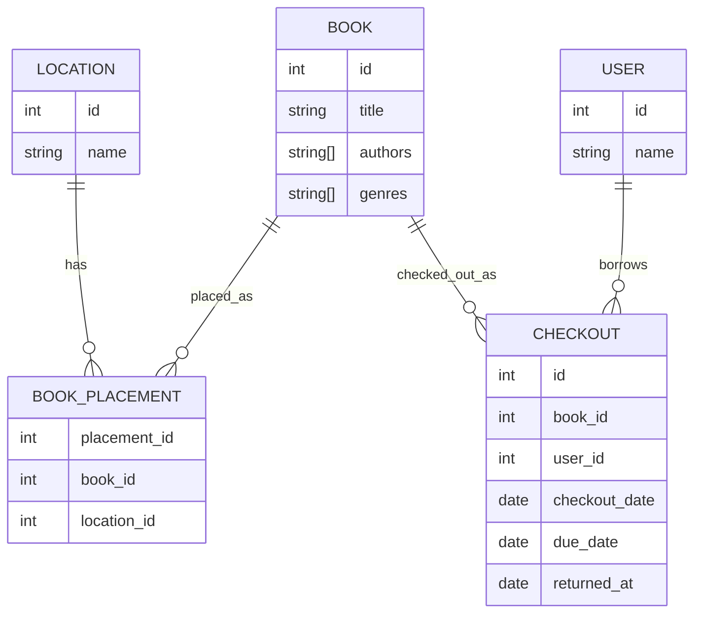

# ドメイン設計

## 目的

実装前にアプリで扱うドメインと責務を整理する。
Book / Location / BookPlacement / Checkout の関係を明確にし、モデルの責務が混ざらないようにする。

## 現状の課題と方針

Book に location を持たせると、Book が「本そのもの」と「場所」の両方を表してしまう。

場所は本そのものの属性ではなく、施設・部屋・本棚などに変化しうる別の概念である。
そのため、場所は Location として表し、Book と Location の関係は BookPlacement として表す。

現在誰が本を所有しているかは Book には持たせず、Checkout が user_id と book_id を持つことで管理する。

## フローチャート図

## E-R 図

## 各モデルの責務

### BookList

Book の集合操作をまとめる。

持つもの:

- books

持たないもの:

- 保存形式
- 表示形式
- ログイン状態

### Book

本そのものの情報を表す。

持つもの:

- id
- title
- authors
- genres

持たないもの:

- 場所
- 現在の所有者
- 貸出状態
- 保存形式

### Location

場所を表す。

持つもの:

- id
- name

持たないもの:

- 本の情報
- 貸出状態
- 保存形式

### BookPlacement

Book と Location の関係を表す。

持つもの:

- placement_id
- book_id
- location_id

持たないもの:

- 本の情報
- 現在の所有者
- 貸出状態
- 保存形式

### User

利用者を表す。

持つもの:

- id
- name

持たないもの:

- ログイン状態
- 貸出中の本の一覧
- 保存形式

### Checkout

誰がどの本を借りているかを表す。

持つもの:

- id
- book_id
- user_id
- checkout_date
- due_date
- returned_at
