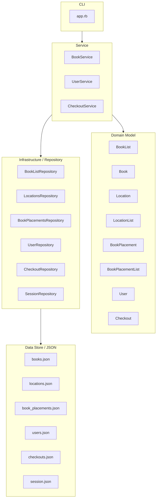
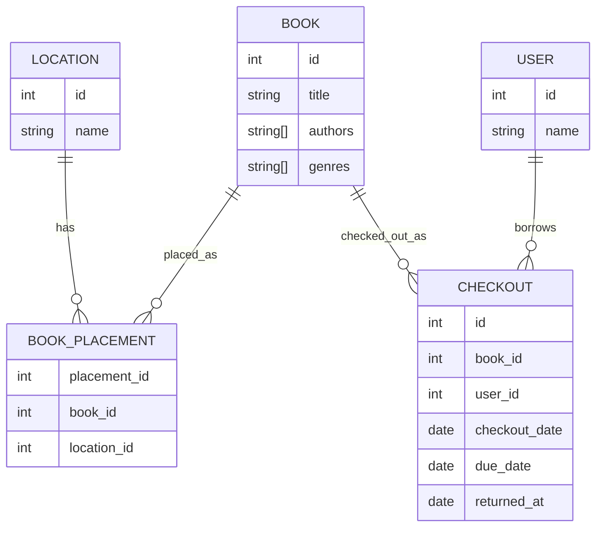

# ドメイン設計

## 目的

実装前にアプリで扱うドメインと責務を整理する。
Book / Location / BookPlacement / Checkout の関係を明確にし、モデルの責務が混ざらないようにする。

## 現状の課題と方針

Book に location を持たせると、Book が「本そのもの」と「場所」の両方を表してしまう。

場所は本そのものの属性ではなく、施設・部屋・本棚などに変化しうる別の概念である。
そのため、場所は Location として表し、Book と Location の関係は BookPlacement として表す。

現在誰が本を所有しているかは Book には持たせず、Checkout が user_id と book_id を持つことで管理する。

## フローチャート図

## E-R 図

## Service の責務

### BookService

CLI コマンドに対応するユースケースの入口を持つ。

public に持つもの:

- `add`
- `list`
- `find`
- `locations`
- `new_location_selection_number`

役割:

- Repository から必要なデータを取得する
- BookList / LocationList / BookPlacementList に集合操作を依頼する
- LocationList に登録先 Location の解決を依頼する
- BookList に Book の登録を依頼する
- BookPlacementList に Book と Location の配置登録を依頼する
- CLI が表示に使うデータを返す
- CLI から受け取った入力値をユースケースとして解釈する

持たないもの:

- JSON の保存形式の詳細
- Book 自身の内部状態変更
- Location や BookPlacement の集合操作そのもの
- CLI の表示文言

## Repository の責務

### BookListRepository

`books.json` の保存／復元を担当し、`BookList` を返す。

持たないもの:

- Location の復元
- BookPlacement の復元
- CLI の表示文言

### LocationsRepository

`locations.json` の保存／復元を担当し、`LocationList` を返す。

持たないもの:

- Book の復元
- BookPlacement の復元
- CLI の表示文言

### BookPlacementsRepository

`book_placements.json` の保存／復元を担当し、`BookPlacementList` を返す。
`book_id` / `location_id` から `Book` / `Location` を解決するために、Usecase 層から渡された `BookList` / `LocationList` を使う。

持たないもの:

- BookListRepository の呼び出し
- LocationsRepository の呼び出し
- CLI の表示文言

## Domain Model の責務

### BookList

Book の集合操作をまとめる。

持つもの:

- books
- Book の登録
- Book の find 条件に合う本の抽出
- Book 登録時の ID 採番

持たないもの:

- 保存形式
- 表示形式
- ログイン状態
- Location の詳細

### Book

本そのものの情報を表す。

持つもの:

- id
- title
- authors
- genres
- attributes

持たないもの:

- 場所
- 現在の所有者
- 貸出状態
- 保存形式

### Location

場所を表す。

持つもの:

- id
- name

持たないもの:

- 本の情報
- 貸出状態
- 保存形式

### LocationList

Location の集合操作をまとめる。

持つもの:

- locations
- Location の追加
- Location の名前検索または作成
- Location の名前検索
- Location の ID 検索
- 選択番号から Location を取得する処理
- 新規 Location 選択番号の判定
- Location 作成時の ID 採番

持たないもの:

- 本の情報
- BookPlacement の情報
- 保存形式
- 表示結果全体の整形

### BookPlacement

Book と Location の関係を表す。

持つもの:

- placement_id
- book
- location
- attributes
- location_name

持たないもの:

- 現在の所有者
- 貸出状態
- 保存形式

### BookPlacementList

BookPlacement の集合操作をまとめる。

持つもの:

- book_placements
- BookPlacement の配置登録
- BookPlacement 登録時の ID 採番
- Book に対応する BookPlacement を取得する処理
- 複数の Book に対応する BookPlacement を取得する処理

持たないもの:

- Location の詳細
- 保存形式
- 表示形式

### User

利用者を表す。

持つもの:

- id
- name

持たないもの:

- ログイン状態
- 貸出中の本の一覧
- 保存形式

### Checkout

誰がどの本を借りているかを表す。

持つもの:

- id
- book_id
- user_id
- checkout_date
- due_date
- returned_at
