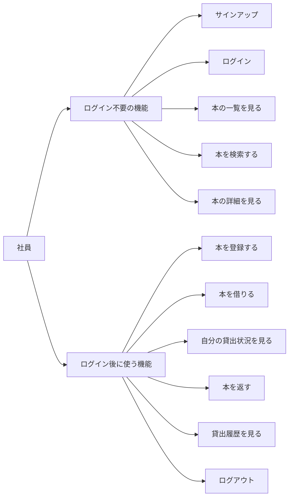

# 蔵書管理CLIアプリ 仕様書

## 目的

社内参考書の場所、重複購入、検索、貸出状況を管理できるCLIアプリを作る。

## 解決したい課題

- 社内に置いてある本を重複購入してしまう
- 本の場所や貸出状況が分からない

## 利用者

- 社員

## ユースケース




### 本の一覧を見る


| 項目   | 内容              |
| ---- | --------------- |
| アクター | 社員              |
| 目的   | 登録済みの社内参考書を確認する |
| 事前条件 | なし              |


#### 基本フロー

1. 社員が一覧表示を実行する
2. アプリは登録されている本を取得する
3. アプリは書籍ID、タイトル、貸出状況を表示する

### 本を検索する


| 項目   | 内容            |
| ---- | ------------- |
| アクター | 社員            |
| 目的   | 必要な社内参考書を見つける |
| 事前条件 | なし            |


#### 基本フロー

1. 社員が検索キーワードを指定して検索する
2. アプリは書籍ID、タイトル、作者、ジャンル、場所を対象に検索する
3. アプリは一致した本を一覧表示と同じ形式で表示する

### 本を借りる


| 項目   | 内容                                    |
| ---- | ------------------------------------- |
| アクター | ログイン済み社員                              |
| 目的   | 社内参考書を借りる                             |
| 事前条件 | 社員がログインしている 対象の本が登録されている 対象の本が貸出中ではない |


#### 基本フロー

1. 社員が貸出したい本の書籍IDと貸出日を入力する
2. アプリは本の存在を確認する
3. アプリは貸出中でないことを確認する
4. アプリは貸出情報を保存する
5. アプリは貸出完了を表示する

#### 例外フロー

- ログインしていない場合はエラーを表示する
- 本が存在しない場合はエラーを表示する
- すでに貸出中の場合は返却予定日を表示する

### 本を返す


| 項目   | 内容                            |
| ---- | ----------------------------- |
| アクター | ログイン済み社員                      |
| 目的   | 借りている本を返却する                   |
| 事前条件 | 社員がログインしている 対象の貸出が自分の未返却貸出である |


#### 基本フロー

1. 社員が貸出No.を指定して返却する
2. アプリは貸出No.の存在を確認する
3. アプリは本人の貸出か確認する
4. アプリは返却日を保存する

## 制約

- Rubyで実装する
- CLIアプリとして実装する
- データはJSONファイルで管理する

## 使用するJSONファイル


| ファイル             | 用途               |
| ---------------- | ---------------- |
| `books.json`           | 書籍情報を管理する        |
| `locations.json`       | 場所情報を管理する        |
| `book_placements.json` | 本と場所の関係を管理する     |
| `users.json`           | 利用者情報を管理する       |
| `checkouts.json`       | 貸出情報を管理する        |
| `session.json`         | ログイン中の利用者情報を管理する |


## データモデル

### Book

本そのものを管理する。


| 項目        | 型               | 説明       |
| --------- | --------------- | -------- |
| `id`      | `int`           | 書籍ID 主キー |
| `title`   | `string`        | タイトル     |
| `authors` | `array[string]` | 作者       |
| `genres`  | `array[string]` | ジャンル     |


#### 備考

- 貸出中かどうかは `books.json` に保存しない
- 貸出状況は `checkouts.json` を参照して判定する
- 場所は本そのものの属性ではないため `books.json` には保存しない
- 貸出中に誰が所持しているかは、未返却の `Checkout` の `user_id` から判定する

### Location

場所を管理する。


| 項目     | 型        | 説明      |
| ------ | -------- | ------- |
| `id`   | `int`    | 場所ID 主キー |
| `name` | `string` | 場所名     |


### BookPlacement

どの本がどの場所に属しているかを管理する。


| 項目            | 型     | 説明        |
| ------------- | ----- | --------- |
| `placement_id` | `int` | 主キー       |
| `book_id`     | `int` | 書籍ID。外部キー |
| `location_id` | `int` | 場所ID。外部キー |


#### 備考

- Book と Location の関係を表す
- 場所の構造が変わっても Book には影響させない

### User

利用者を管理する。


| 項目     | 型        | 説明       |
| ------ | -------- | -------- |
| `id`   | `int`    | 社員ID。主キー |
| `name` | `string` | 社員名      |


### Checkout

誰がどの本を借りたのかを管理する。


| 項目              | 型              | 説明        |
| --------------- | -------------- | --------- |
| `id`            | `int`          | 貸出No.。主キー |
| `book_id`       | `int`          | 書籍ID。外部キー |
| `user_id`       | `int`          | 社員ID。外部キー |
| `checkout_date` | `Date`         | 貸出日       |
| `due_date`      | `Date`         | 返却予定日     |
| `returned_at`   | `Date or null` | 返却日       |


#### 備考

- `returned_at` が `null` の場合は未返却とする
- `returned_at` に日付が入っている場合は返却済みとする

## CLIコマンド

### サインアップ

```sh
ruby app.rb signup "山田太郎"
```


| 引数        | 内容       |
| --------- | -------- |
| `ARGV[0]` | `signup` |
| `ARGV[1]` | `name`   |


#### 処理内容

- 名前を受け取る
- 社員IDを自動採番する(E000..999)
- `users.json` に保存する

#### 備考

- 名前の重複は許可する
- 社員IDで一意に管理する

### ログイン

```sh
ruby app.rb login 1
```


| 引数        | 内容            |
| --------- | ------------- |
| `ARGV[0]` | `login`       |
| `ARGV[1]` | `employee_id` |


#### 処理内容

- 社員IDが存在するか確認する
- 存在すれば `session.json` にログイン情報を保存する
- ログイン後、ログインが必要なコマンドを使用できるようにする
- ログインしたユーザーが未返却の本がある場合、貸出Noと返却日を通知する

### ログアウト

```sh
ruby app.rb logout
```


| 引数        | 内容       |
| --------- | -------- |
| `ARGV[0]` | `logout` |


#### 処理内容

- `session.json` を削除、または中身を空にする

### 登録

```sh
ruby app.rb add
```


| 引数        | 内容    |
| --------- | ----- |
| `ARGV[0]` | `add` |

#### 入力項目

`add` コマンド実行後、以下の項目を対話形式で入力する。

| 項目 | 内容 |
| --- | --- |
| タイトル | 登録する本のタイトル |
| 著者 | 著者。共著者がいる場合はカンマ区切りで入力する |
| ジャンル | ジャンル。複数ある場合はカンマ区切りで入力する |
| 保管場所 | 本の保管場所 |

#### 処理内容

- 本を新規登録する
- 書籍IDを自動採番する
- タイトル、著者、ジャンル、保管場所を対話形式で受け取る
- 作者・ジャンルはカンマ区切りで受け取り、配列として保存する
- 入力された場所が存在しない場合は Location として保存する
- Book と Location の関係を BookPlacement として保存する

### 検索

```sh
ruby app.rb search ruby
ruby app.rb search ruby rails
ruby app.rb search 1
```


| 引数           | 内容                |
| ------------ | ----------------- |
| `ARGV[0]`    | `search`          |
| `ARGV[1..n]` | `search_criteria` |


#### 処理内容

- 書籍ID、タイトル、作者、ジャンル、場所を対象に検索する
- 複数条件が指定された場合はAND検索とする
- 検索結果は一覧表示と同じ形式で表示する
- 詳細な情報は `show` コマンドで表示する

#### 表示項目

- 書籍ID
- タイトル
- 貸出状況

### 一覧表示

```sh
ruby app.rb list
```


| 引数        | 内容     |
| --------- | ------ |
| `ARGV[0]` | `list` |


#### 処理内容

- 登録されている本を一覧表示する
- 表示項目は検索結果と同じ形式にする
- 詳細な情報は `show` コマンドで表示する

#### 表示項目

- 書籍ID
- タイトル
- 貸出状況

#### 貸出状況の判定

- `checkouts.json` を参照する
- 該当する `book_id` かつ `returned_at` が `null` の貸出があれば貸出中とする
- 上記に該当する貸出がなければ貸出可能とする

### 本の詳細表示

```sh
ruby app.rb show
```


| 引数        | 内容     |
| --------- | ------ |
| `ARGV[0]` | `show` |


#### 入力項目

`show` コマンド実行後、以下の確認文を表示して対話形式で入力する。

```text
詳細を表示したい本のIDを入力してください
```


| 項目   | 内容          |
| ---- | ----------- |
| 書籍ID | 詳細を表示する本のID |


#### 処理内容

- 指定された本の詳細を表示する

#### 表示例

```text
ID: 1
Title: リーダブルコード
Authors: Dustin Boswell, Trevor Foucher
Genres: Programming, Code Quality
Location: アネックス
Status: 貸出中
Due date: 2026-05-30
Borrower: 山田太郎
```

### 貸出

```sh
ruby app.rb checkout
```


| 引数        | 内容         |
| --------- | ---------- |
| `ARGV[0]` | `checkout` |


#### 入力項目

`checkout` コマンド実行後、以下の確認文を表示して対話形式で入力する。

```text
借りたい本のIDを入力してください
貸出日を8桁で入力してください（例: 20260519）
```


| 項目   | 内容                  |
| ---- | ------------------- |
| 書籍ID | 貸出したい本のID           |
| 貸出日  | `YYYYMMDD` 形式の8桁の日付 |


#### 処理内容

- ログイン済みユーザーを貸出者として扱う
- 書籍IDと貸出日を対話形式で受け取る
- 貸出日は `YYYYMMDD` 形式の8桁で受け取る
- 指定された本が存在するか確認する
- 貸出中でないか確認する
- 貸出可能であれば `checkouts.json` に貸出情報を追加する
- `due_date` を設定する

#### 貸出中の場合

- `AlreadyCheckout` エラーを出力する
- `due_date` を表示する

#### 警告例

```text
AlreadyCheckout: この本は貸出中です。
Due date: 2026-05-10
```

### 自分の貸出一覧

```sh
ruby app.rb loans
```


| 引数        | 内容      |
| --------- | ------- |
| `ARGV[0]` | `loans` |


#### 処理内容

- ログイン中ユーザーの未返却貸出一覧を表示する
- 返却時に必要な `checkout_id` も表示する
- 表示形式は `list` と同じく、書籍ID、タイトル、貸出状況を中心にする

#### 表示項目

- 貸出No.
- 書籍ID
- タイトル
- 貸出状況

### 返却

```sh
ruby app.rb return 3
```


| 引数        | 内容            |
| --------- | ------------- |
| `ARGV[0]` | `return`      |
| `ARGV[1]` | `checkout_id` |


#### 処理内容

- 指定された貸出No.が存在するか確認する
- ログイン中ユーザー本人の貸出か確認する
- 未返却であることを確認する
- `returned_at` に返却日を入れる

#### 備考

- `checkout_id` は `loans` コマンドで確認する

### 履歴

```sh
ruby app.rb history
```


| 引数        | 内容        |
| --------- | --------- |
| `ARGV[0]` | `history` |


#### 処理内容

- ログイン中ユーザーの貸出履歴を表示する
- 返却済み・未返却の両方を表示する
- 表示形式は `list` と同じく、書籍ID、タイトル、貸出状況を中心にする

#### 表示項目

- 貸出No.
- 書籍ID
- タイトル
- 貸出状況

## ログイン要否

### ログインが必要なコマンド

- `add`
- `checkout`
- `return`
- `loans`
- `history`

### ログイン不要のコマンド

- `signup`
- `login`
- `logout`
- `list`
- `search`
- `show`

## 貸出状態の考え方

`books.json` には貸出状態を保存しない。

貸出中かどうかは、毎回 `checkouts.json` を参照して判定する。

判定条件:

- `book_id` が一致する
- かつ `returned_at` が `null`

この条件に一致する `Checkout` が存在する場合、その本は貸出中とする。

## 余力があれば

- 自動ログアウト
- 管理者権限
- 貸出期限超過者への通知
